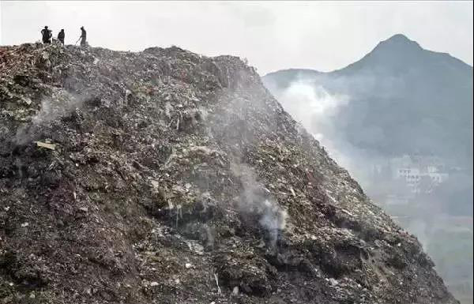

# Garbage Sorting Assistant

**Power Environmental Protection by Machine Learning**

Inspired by [Android Developer Challenge](https://developer.android.google.cn/dev-challenge), I come out with an idea.

This project aims to build an **Android application** which uses **machine learning** to classify categories of garbage and guide people to put them into the right waste bins.

## Why we need Garbage Sorting

In today's matrial world, we human begings generate huge sum of waste in our daily life. Many cities are inundated with the large number of waste and finding proper place to arrange it is becoming serious problem.

For individuals, some may believe disposing waste is effortless because they just need to pack it up and then throw it into a waste bin. At the city level, however, it is not exaggerating to say that it is almost war every day to cope with those garbage.
And the situation will even worse in the future, according to the World Bank’s new What a Waste 2.0:  [A Global Snapshot of Solid Waste Management to 2050 report](https://openknowledge.worldbank.org/handle/10986/30317)

However, for the better part of the country, many countries are still disposing waste with traditional incinerating, compost and landfill. These methods are all inefficient and pose a great burdon to cities.

One solution to tackle with this problem is garbage sorting. The most significant benefits is that it helps recycling. If waste had been well categorized, then governments could save labour in separating the wheat from the chaff. Another point to make is that it is helpful to cope with different kind waste in different ways. For example, uncompleted burning of waste will produce carcinogen, so it is neccesary to deal with wet waste in other ways than burning together with dry waste.

## Garbage Sorting in China

The problem of marching garbage are particularly serious in China. The statistics published by Chinese Ministry of Housing and Urban-Rural Development showed that more than 2/3 of big cities are surrounding by waste and about 1/4 of them have already got no proper space for more waste.

Chinese government has been instigating positive changes in policy with garbage collection since 2000. In the first period, citizens has been encouraged to sort household garbage voluntarily. At July 1th 2019, Shanghai became the first city started enforcing its regulation on domestic waste management and make garbage classification compulsory, instead of voluntary. Later on, other big cities such as Beijing and Shenzhen have enacted or revised regulations on garbage classification to enhance the guidance of people's actions.

As we can see that as Chinese government and people are placing more and more emphisis on garbage collection, this policy are going into be an important part of citizens' daily routine for a very long time.

## Difficulties in instigating Garbage Sorting in China

The new regulation requires people to sort trash into four categories - household food waste, recyclables and hazardous waste, residual waste. Individuals and companies who fail to do so may be fined up to 50,000 yuan.

After serval months' obversation and also from my personal experience, the major hurdle is not people's willness to sort their trash, instead, it is they are often confused about how to sort some vague items.

The image is a guidance for how to match common waste with the bins. As we can see, the rules are a bit tricky, and it can be hard for some people to memorized. Even there was a board behind the bins, finding the right one is also time-consuming. 
 

Furthur, if we got some uncommon waste, if we do not have a notebook in hand or not have enough time and patience to look it up. What we only can do is to guess, and that is actually most people will do. 

For example, which bins of the four (household food waste, recyclables and hazardous waste, residual waste) do you think a "Pencil" should be in? Well, the first one to the mind is "Recyclables", because I believe someone may want to reuse it. Then I would be fined because pencil contains lead which is noxious, it belongs to the "Hazardous waste" bin. It really needs some knowledge of chemistry, don't it?
There are also some examples out of my knowledge, such as mirror which belongs to hazardous, tabacoo(residual waste) ect.

## How my idea can help with Garbage Sorting

So I alight upon on an idea of **building an Android application which contains an offline tensorflow model** to help people sort the garbage. 

Firstly, I will use **Tensorflow** to train a model for waste classification. The input data needs to be collected and labeled. The output of this model is second last layer will be a softmax layer which indicates the category of a waste, and finnally it will be mapped with four kinds of bins.

Secondly, this model will be converted into **Flatbuffer** file and integrated together with **Tensorflow lite** into an Android application.

Here is a typical scenario. When user opens the "Garbage sorting" application, the model will be loaded. Camera will be opened while user clicks the "sort" button, then frames will be used as input to the network and the result will be displayed as soon as it finishes computation.

 
 

### About me

